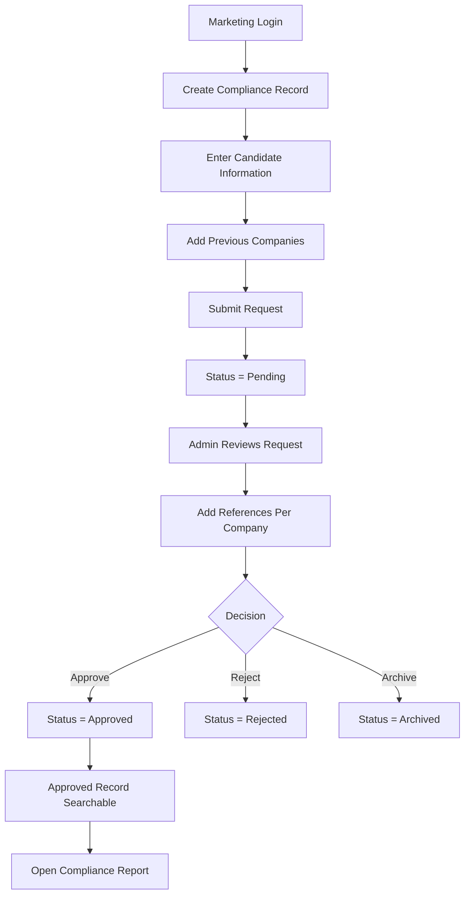

## 1. Product Overview
Compliance Management System (CMS) is a production-ready enterprise SaaS application for managing candidate compliance requests from submission through approval and reporting.
- It serves two roles, Marketing and Admin, with a strict workflow, searchable approved records, and polished dark-mode UX.
- The product value is operational speed, auditability, and a premium experience for internal compliance teams.

## 2. Core Features

### 2.1 User Roles
| Role | Access Method | Core Permissions |
|------|---------------|------------------|
| Admin | Supabase Auth login only | View all records, manage references, approve/reject/archive, export and print reports, manage searchable approved database |
| Marketing | Supabase Auth login only | Create records, edit drafts before submission, add candidate and previous company details, submit requests, track own requests, search own submissions |

### 2.2 Feature Modules
1. **Login**: branded auth page, Supabase session handling, role-aware redirect
2. **Dashboard**: KPI cards, pending reviews, recent activity, workflow overview, charts, quick actions
3. **Compliance Records**: searchable table or mobile cards, filters, sorting, pagination, export, status badges, row actions
4. **Create Compliance Record**: multi-step form for candidate and vendor details, duplicate candidate detection, dynamic previous companies
5. **Pending Review Workspace**: admin review surface with accordion-based company sections and nested references
6. **Approved Records Search**: live search across approved or visible records with role-aware visibility
7. **Compliance Report**: premium report view matching the provided hierarchy with print/export/share actions
8. **Settings and Session Controls**: profile shell, sign out, theme persistence, error states

### 2.3 Page Details
| Page Name | Module Name | Feature Description |
|-----------|-------------|---------------------|
| Login | Auth panel | Email and password login, validation, loading state, role-based post-login routing |
| Dashboard | Statistics cards | Animated counters for total, pending, approved, rejected, archived, recent activity, pending reviews |
| Dashboard | Activity timeline | Recent status changes, submissions, approvals, and admin actions |
| Dashboard | Quick actions | Create record, review pending, open approved search, export report |
| Compliance Records | Data table | Search, status filters, sorting, pagination, CSV export, sticky header, responsive fallback cards |
| Compliance Records | Row actions | View, edit, approve, reject, archive, delete where allowed |
| Create Record | Step 1 compliance info | Candidate name, visa, technology, applied role, location, contract tenure, vendor and client details |
| Create Record | Step 2 previous companies | Unlimited companies with ordering, date ranges, add/remove controls |
| Pending Review | Review accordion | One accordion item per previous company, unlimited references nested within |
| Pending Review | Approval actions | Save draft, reject with notes, approve record |
| Search | Live results | Search by candidate, technology, vendor, client, visa, role, status |
| Report | Candidate summary | Information hierarchy matching the provided screenshot in a modernized dark UI |
| Report | Company and references | Previous companies, references, reference details, notes, printable layout |
| Report | Utility actions | Print, export PDF, export CSV, copy link |

## 3. Core Process
Marketing users create a compliance record, complete candidate and previous company details, and submit the request. The record moves to Pending status and becomes visible to Admin users for review. Admin users add references to each previous company, then approve, reject, or archive the request. Approved records become searchable and accessible through the compliance report experience.

## 4. User Interface Design

### 4.1 Design Style
- Primary color: `#3B82F6`
- Accent color: `#8B5CF6`
- Background: `#0F172A`
- Card background: `#111827`
- Surface treatment: glassmorphism panels, translucent borders, soft inner highlights
- Corner style: rounded `xl` and `2xl` cards with premium depth
- Typography: modern SaaS hierarchy with restrained sizes and strong contrast
- Motion: framer-motion fades, slides, scale transitions, counter animation, hover glow
- Navigation: responsive left sidebar that collapses into a drawer on mobile
- Icons: lucide-react icons only

### 4.2 Page Design Overview
| Page Name | Module Name | UI Elements |
|-----------|-------------|-------------|
| Login | Auth shell | Split layout, glass card, subtle background gradients, concise enterprise copy |
| Dashboard | KPI grid | Elevated cards, animated numbers, micro trend indicators, shimmer loading |
| Dashboard | Charts and timeline | Gradient chart panels, vertical activity list, hover detail states |
| Compliance Records | Table shell | Toolbar, command-style search, filters, sticky header, badges, dropdown row actions |
| Create Record | Multi-step form | Progress indicator, card sections, inline validation, motion between steps |
| Pending Review | Admin accordion | Rich accordion cards, nested reference forms, compact status controls |
| Search | Result grid | Search command bar, facet chips, responsive cards on smaller screens |
| Report | Report surface | Structured sections, metadata chips, grouped companies and references, print-friendly composition |

### 4.3 Responsiveness
- Desktop-first layout with strong large-screen information density
- Tablet layout keeps sidebar reduced and stacks secondary content
- Mobile layout converts sidebar to drawer, tables to cards, and actions to menus or drawers
- All form controls remain touch friendly with vertical stacking and large targets

### 4.4 UX and Feedback
- Skeleton loaders for all primary surfaces
- Toast notifications for auth, save, submit, approve, reject, export, and copy-link actions
- Empty states for search, tables, pending lists, and report data gaps
- Error boundaries for route-level failures
- Optimistic UX where safe, paired with server-confirmed status updates
