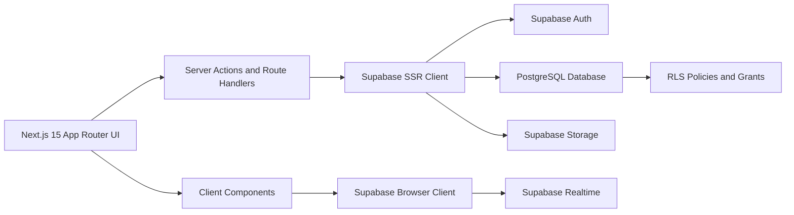
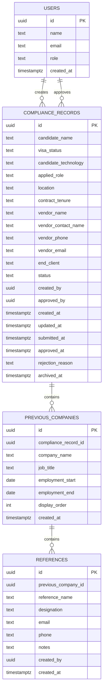

## 1. Architecture Design



## 2. Technology Description
- Frontend framework: `next@15` with App Router and TypeScript
- Runtime and package manager: Bun
- Styling: Tailwind CSS with shadcn/ui and custom design tokens
- Motion: Framer Motion
- Forms and validation: React Hook Form + Zod
- Data table: TanStack Table
- Data fetching and caching: TanStack Query
- Icons: lucide-react
- Backend layer: Next.js Server Actions and Route Handlers
- Database and auth: Supabase PostgreSQL + Supabase Auth
- File and export support: Supabase Storage plus server-generated CSV and PDF exports
- Deployment target: Vercel

## 3. Route Definitions
| Route | Purpose |
|-------|---------|
| `/login` | Login-only authentication page |
| `/` | Auth-aware landing route that redirects to dashboard or login |
| `/dashboard` | KPI dashboard for records, activity, and quick actions |
| `/records` | Role-aware records table with filters and actions |
| `/records/new` | Marketing multi-step create form |
| `/records/[id]/edit` | Edit form for draft or allowed records |
| `/records/[id]/review` | Admin review workspace for pending records |
| `/records/[id]/report` | Compliance report page with print and export actions |
| `/pending` | Admin-focused pending request queue |
| `/approved` | Approved records view and searchable approved dataset |
| `/search` | Global compliance search interface |
| `/settings` | Account and application preferences |

## 4. Application Structure
| Directory | Purpose |
|-----------|---------|
| `app/(auth)` | Login and auth-related pages |
| `app/(dashboard)` | Protected application shell and feature routes |
| `app/api` | Route handlers for exports, printing helpers, and utility endpoints |
| `components/ui` | shadcn/ui primitives |
| `components/layout` | Sidebar, header, breadcrumbs, page shells |
| `components/dashboard` | KPI cards, charts, timeline, quick actions |
| `components/records` | Data table, status badge, row actions, search filters |
| `components/forms` | Multi-step form, company fields, reference inputs |
| `components/report` | Report sections, summary cards, export actions |
| `components/shared` | Empty states, loading states, motion wrappers |
| `lib/supabase` | Browser, server, middleware, and admin clients |
| `lib/auth` | Role helpers, session validation, route guards |
| `lib/db` | Query helpers and typed data access |
| `lib/validations` | Zod schemas |
| `lib/types` | Shared application types and database types |
| `lib/utils` | Formatting, export helpers, class merging, constants |
| `supabase/migrations` | SQL schema, seed, triggers, RLS, grants |
| `tests` | Unit and integration tests |

## 5. Data Model

### 5.1 Entity Relationship



### 5.2 Table Design Notes
- `users` is an app profile table keyed to `auth.users.id` and used for role lookup and UI metadata.
- `compliance_records.status` allowed values: `Draft`, `Pending`, `Approved`, `Rejected`, `Archived`.
- Duplicate detection will use a normalized candidate identity check based on candidate name plus selected business fields.
- Previous companies and references are modeled as nested one-to-many relations for unlimited entries.
- Logical ordering is stored through `display_order`.

## 6. Access Control and Security
| Resource | Marketing | Admin |
|----------|-----------|-------|
| `users` | Read own profile | Read all profiles |
| `compliance_records` | Create, read own, update own drafts, submit own records | Read all, update all, approve, reject, archive |
| `previous_companies` | Manage companies for own editable records | Manage for all allowed records |
| `references` | No access to create or modify | Full create, update, delete for review workflow |

### 6.1 RLS Strategy
- Enable RLS on every exposed table in `public`
- Use `TO authenticated` policies plus row ownership predicates for Marketing access
- Use role checks against the `users` table for Admin access
- Avoid authorization based on mutable `user_metadata`
- Add explicit `GRANT` statements because new public tables are not automatically exposed in current Supabase projects
- Require both `USING` and `WITH CHECK` on update policies

### 6.2 Auth and Role Model
- Supabase Auth provides login-only access
- No public signup route
- Admin creates users directly in Supabase Auth
- A profile row in `public.users` is provisioned after auth user creation
- Middleware checks session existence and redirects unauthenticated users
- Server-side role guard protects sensitive routes and server actions

## 7. Query and Data Access Strategy
- Use server components for initial protected page fetches
- Use server actions for create, update, submit, approve, reject, archive, and export operations
- Use React Query for client-side table refresh, live search, and realtime-assisted updates
- Prefer typed select queries that fetch nested companies and references in one round trip for report pages
- Add indexes for status, created_by, candidate_name, vendor_name, end_client, created_at, and nested foreign keys

## 8. Realtime and Activity Model
- Realtime subscriptions refresh dashboard metrics, pending queues, and report status surfaces
- Activity timeline is derived from record mutations and key status timestamps
- Toast notifications communicate completed actions after server confirmation

## 9. Export and Reporting Strategy
- CSV export generated on the server from normalized report rows
- Excel export generated server-side through a lightweight workbook library
- PDF export produced from a print-optimized report route or PDF rendering utility
- Print action uses a dedicated print stylesheet optimized for dark-to-print contrast handling

## 10. Database Definition Language

### 10.1 Core Schema Outline
```sql
create extension if not exists pgcrypto;

create table public.users (
  id uuid primary key,
  name text not null,
  email text not null unique,
  role text not null check (role in ('Admin', 'Marketing')),
  created_at timestamptz not null default now()
);

create table public.compliance_records (
  id uuid primary key default gen_random_uuid(),
  candidate_name text not null,
  visa_status text not null,
  candidate_technology text not null,
  applied_role text not null,
  location text not null,
  contract_tenure text not null,
  vendor_name text not null,
  vendor_contact_name text not null,
  vendor_phone text not null,
  vendor_email text not null,
  end_client text not null,
  status text not null check (status in ('Draft', 'Pending', 'Approved', 'Rejected', 'Archived')),
  created_by uuid not null,
  approved_by uuid,
  rejection_reason text,
  submitted_at timestamptz,
  approved_at timestamptz,
  archived_at timestamptz,
  created_at timestamptz not null default now(),
  updated_at timestamptz not null default now()
);

create table public.previous_companies (
  id uuid primary key default gen_random_uuid(),
  compliance_record_id uuid not null,
  company_name text not null,
  job_title text not null,
  employment_start date not null,
  employment_end date not null,
  display_order integer not null default 0,
  created_at timestamptz not null default now()
);

create table public.references (
  id uuid primary key default gen_random_uuid(),
  previous_company_id uuid not null,
  reference_name text not null,
  designation text not null,
  email text,
  phone text,
  notes text,
  created_by uuid not null,
  created_at timestamptz not null default now()
);
```

### 10.2 Required Indexes
```sql
create index compliance_records_status_idx on public.compliance_records(status);
create index compliance_records_created_by_idx on public.compliance_records(created_by);
create index compliance_records_candidate_name_idx on public.compliance_records(candidate_name);
create index compliance_records_vendor_name_idx on public.compliance_records(vendor_name);
create index compliance_records_end_client_idx on public.compliance_records(end_client);
create index previous_companies_record_id_idx on public.previous_companies(compliance_record_id);
create index previous_companies_display_order_idx on public.previous_companies(compliance_record_id, display_order);
create index references_previous_company_id_idx on public.references(previous_company_id);
```

### 10.3 Triggers and Policies
- Trigger to set `updated_at` on every record change
- Trigger or provisioning workflow to ensure `public.users` profile existence for each authenticated user
- RLS policies for role-based row access
- Explicit grants to `authenticated` for each exposed table, scoped by RLS

## 11. Middleware and Session Handling
- Next.js middleware refreshes Supabase sessions
- Protected route groups redirect unauthenticated users to `/login`
- Authenticated users hitting `/login` are redirected to their appropriate workspace

## 12. Testing Strategy
- Unit tests for schema validation and permission helpers
- Component tests for multi-step form, status badges, report sections, and table behaviors
- Integration tests for server actions and route guards
- SQL verification through migration review and table inspection after applying schema
